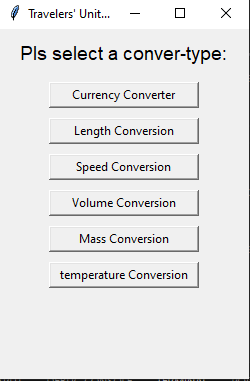
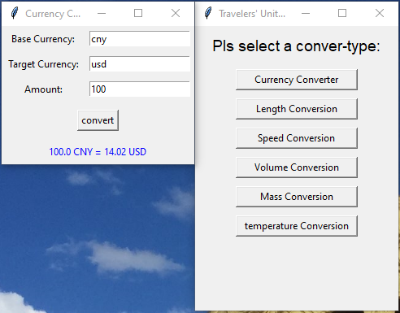
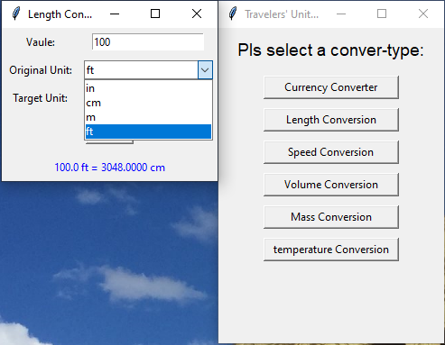
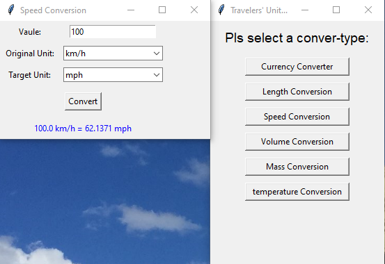
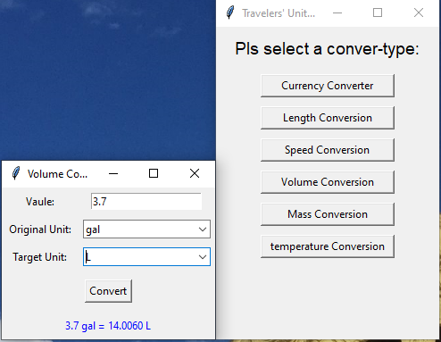
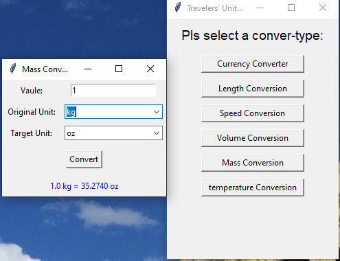
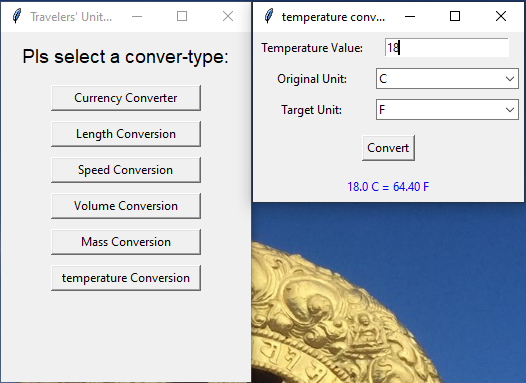

# Travelers' Unit Converter 
## Author: Shaoxian Duan
**Date:** 2023-09-09  
A multifunctional unit converter designed for travelers.  
It supports **currency conversion**, **length**, **speed**, **volume**, **mass**, and **temperature** conversions.  


---

## Features

- **Currency Converter**
  - Converts between any two currencies using [ExchangeRate-API](https://www.exchangerate-api.com/).
  - Handles invalid input and unsupported currencies gracefully.



- **Length Conversion**
  - Supports conversions between inches (`in`), centimeters (`cm`), meters (`m`), and feet (`ft`).

  

- **Speed Conversion**
  - Converts between kilometers per hour (`km/h`) and miles per hour (`mph`).



- **Volume Conversion**
  - Converts between gallons (`gal`) and liters (`L`).



- **Mass Conversion**
  - Converts between pounds (`lb`), ounces (`oz`), and kilograms (`kg`).




- **Temperature Conversion**
  - Converts between Celsius (`C`), Fahrenheit (`F`), and Kelvin (`K`).



- Automatic window resizing ensures all windows display properly.

---

## Dependencies

- Python 3.x
- Tkinter (usually included with Python)
- Requests (`pip install requests`)

---

## Usage

1. download this script:

```bash
# curl
curl -o converter.py https://raw.githubusercontent.com/shaoxianduan/shaoxianduan.github.io/main/python/converter/converter.py


